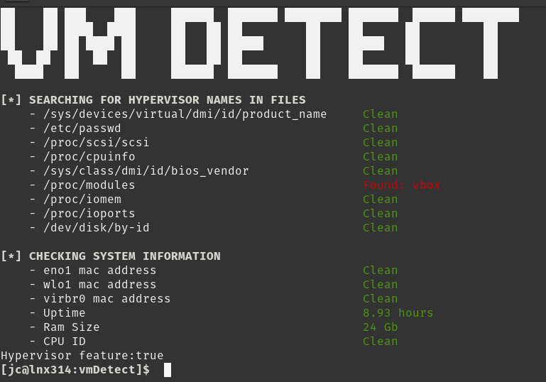
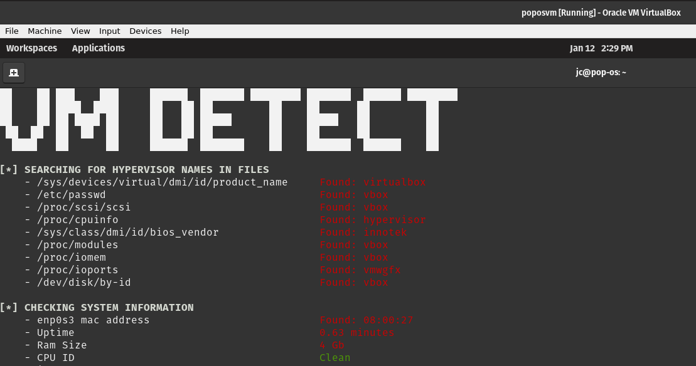

# vmdetect
Golang tool to detect Linux based vm/malware analysis environments (Inpired by PaFish).

This tool will focus on Linux environments and use the same techniques (or a few of those techniques) implemented by malware  to detect virtual/analysis environments. The idea is to be aware of the artifacts present in the system that can tip the malware about an analysis environment.

Also, all the artifacts related to vms/hypervisors are provided to the program separately in a file called artifacts.txt, in this way we will be able to extend the items to check without having those velues hardcoded into the program

This is a work in progress but pretty functional.

